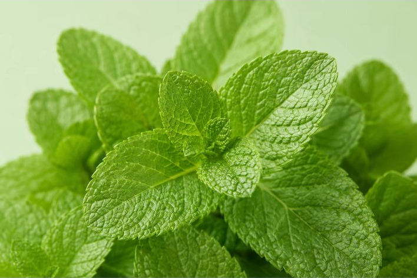
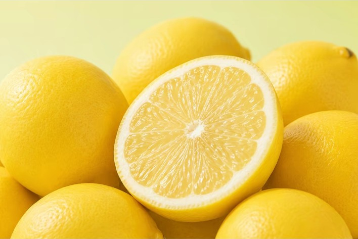
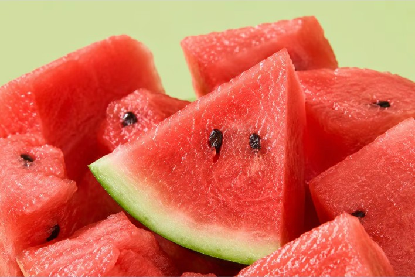
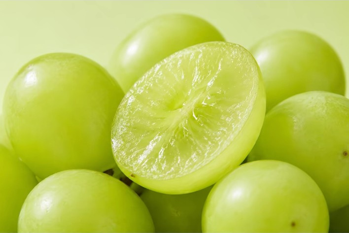

# 03 布局参考：商品满铺、细节主体突出

来源：用户提供的五张布局参考。原图保存在 Skill 的 `assets/composition-03/`，规划 03 时查看与当前商品形态相符的示例。这是一种可选构图，不要求每张 03 都满铺。

## 提取的关系

- 商品可以聚集到画面边缘，少露或不露背景；无需为了留白拉开取景。
- 必须有一个清楚的视觉主体。水果可用切面、剥好果肉或切瓣；其他商品选本品有价值的叶层、组织或结构，不强制切开。
- 周围同商品提供身份和层次，通过朝向、形状、自然明暗、遮挡和景深形成陪衬。主体不靠纹理增强或过度锐化突出。
- 数量、切法、承托和连接必须受本品实拍及用户授权约束，不能为满铺擅自添果、复制相同个体或隐藏结构缺失。边缘陪体可以有目的裁切，核心细节应保持可读。
- 示例只约束构图关系，不提供当前商品的颜色、成熟度、微纹理或内部组织事实；不统一沿用示例的绿色或粉色背景。横幅示例映射到独立 1:1 输出，不复制精确坐标。
- 本品至少两张互补实拍仍为实际生图输入。若额外上传其中一张布局图，明确标注“仅构图参考”，并如实记录；不能替代本品实拍。

## 五张参考

### 薄荷：聚集叶层中的主体

中央叶簇清楚，周围叶片从多方向形成连续铺陈。借鉴自然展开和前后层次；叶脉强度由本品实拍决定，不把示例叶片当作其他商品的装饰。

### 柠檬：整果围绕切面

倾斜切面作为视觉锚点，周围整果延伸至边缘。借鉴切面朝向和整体陪衬；不要求所有圆形水果使用同一角度。

### 西瓜：切块围绕主要切瓣

前景主要切瓣形状可读，周围切块形成不同方向和高度的层次。借鉴切块组合；切法、籽和果皮厚度按本品实拍与当前要求决定。

### 玫瑰：同类结构中的清楚主体

一朵花为视觉主体，周围同类花朵形成陪衬。仅借鉴清晰度、朝向和层次的主次关系，不在食品图中新增花卉。

### 葡萄：完整果粒围绕内部细节

切开的果粒作为主体，周围完整果粒提供识别线索和画面铺陈。借鉴小果与切面关系；剖面可行性和内部组织以本品实拍为准。

